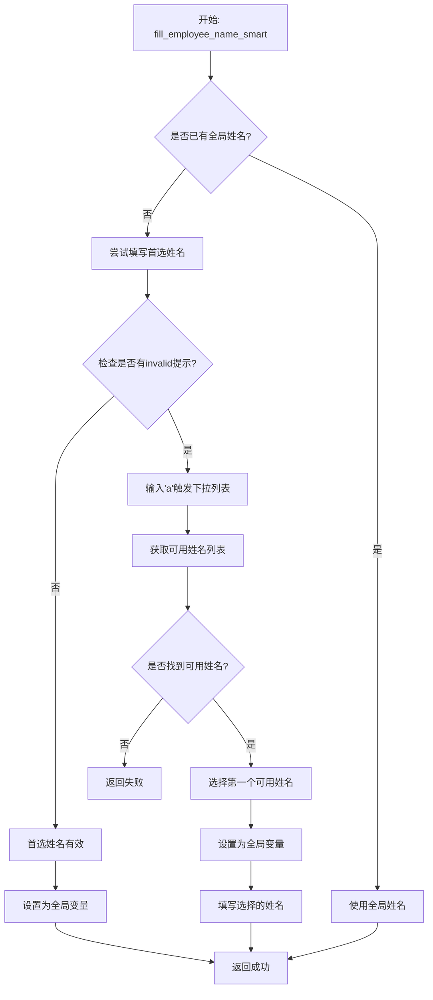

# 动态员工姓名解决方案

## 🎯 问题描述

**原问题**: 同一个登录账号，但是右上角的username总是在不断变化，username一变化，`create_claim_request_page.fill_employee_name("Timothy Amiano")`中的employeename就会变成不合法。

**需求**: 
1. 如果名字是合法的，就按脚本继续执行
2. 如果提示invalid，输入'a'，弹框会自动关联合法的名字
3. 直接在这些里面选择一个可用的，并把这个employeename作为一个全局变量
4. 后续涉及这个字段，统一用取到的这个可用值，不要用写死的值

## ✅ 解决方案

### 🔧 核心功能实现

#### 1. **全局变量机制**
```python
class OrangeHRMCreateClaimRequestPage(BasePage):
    # 全局变量：存储可用的员工姓名
    _valid_employee_name = None
    
    @classmethod
    def get_valid_employee_name(cls):
        """获取全局可用的员工姓名"""
        return cls._valid_employee_name
    
    @classmethod
    def set_valid_employee_name(cls, name):
        """设置全局可用的员工姓名"""
        cls._valid_employee_name = name
```

#### 2. **智能员工姓名填写**
```python
def fill_employee_name_smart(self, preferred_name="Timothy Amiano"):
    """智能填写员工姓名（如果无效则自动选择可用的）"""
    # 1. 检查是否已有全局可用姓名
    if self._valid_employee_name:
        return self.fill_employee_name(self._valid_employee_name)
    
    # 2. 尝试填写首选姓名
    if self.fill_employee_name(preferred_name):
        # 3. 检查是否有invalid提示
        if self.check_invalid_employee_name():
            # 4. 获取可用姓名列表
            available_names = self.get_available_employee_names()
            if available_names:
                # 5. 选择第一个可用姓名
                selected_name = available_names[0]
                self.set_valid_employee_name(selected_name)
                return self.fill_employee_name(selected_name)
        else:
            # 首选姓名有效，设置为全局变量
            self.set_valid_employee_name(preferred_name)
            return True
```

#### 3. **Invalid检测机制**
```python
def check_invalid_employee_name(self):
    """检查是否有invalid员工姓名提示"""
    invalid_selectors = [
        (By.XPATH, "//*[contains(text(),'Invalid')]"),
        (By.XPATH, "//*[contains(text(),'invalid')]"),
        (By.XPATH, "//*[contains(text(),'not found')]"),
        (By.XPATH, "//*[contains(text(),'No Records Found')]"),
        (By.XPATH, "//span[contains(@class,'error')]"),
        (By.XPATH, "//div[contains(@class,'error')]"),
    ]
    # 检测逻辑...
```

#### 4. **可用姓名获取**
```python
def get_available_employee_names(self):
    """获取可用的员工姓名列表"""
    # 1. 清空输入框并输入'a'来触发下拉列表
    employee_input.clear()
    employee_input.send_keys("a")
    
    # 2. 获取下拉列表中的选项
    options = self.driver.find_elements(*dropdown_selector)
    available_names = [option.text.strip() for option in options]
    
    return available_names
```

### 🚀 使用方法

#### **在pages/2.py中的修改**

**修改前**:
```python
create_claim_request_page.fill_employee_name("Timothy Amiano")
```

**修改后**:
```python
# 使用智能员工姓名填写，自动适应不同登录账号
create_claim_request_page.fill_employee_name_smart("Timothy Amiano")
# 获取实际使用的员工姓名作为全局变量
actual_employee_name = create_claim_request_page.get_valid_employee_name()
print(f"实际使用的员工姓名: {actual_employee_name}")
```

#### **后续验证使用全局变量**

**修改前**:
```python
create_claim_request_page.verify_claim_details("Timothy Amiano")
create_claim_request_page.verify_claim_data_consistency({
    "employee_name": "Timothy Amiano", 
    "event": "Travel allowances", 
    "currency": "Euro"
})
```

**修改后**:
```python
# 自动使用全局员工姓名
create_claim_request_page.verify_claim_details()  
create_claim_request_page.verify_claim_data_consistency({
    "employee_name": actual_employee_name,  # 使用实际的姓名
    "event": "Travel allowances", 
    "currency": "Euro"
})
```

### 🧠 智能逻辑流程



### 🎯 技术优势

#### 1. **自动适应性**
- ✅ 自动适应不同的登录账号
- ✅ 优先使用指定的姓名
- ✅ 自动选择可用的替代姓名

#### 2. **全局一致性**
- ✅ 全局变量确保整个测试流程使用一致的员工姓名
- ✅ 避免硬编码的姓名导致的问题
- ✅ 一次设置，全程使用

#### 3. **智能检测**
- ✅ 多种invalid提示检测策略
- ✅ 自动触发下拉列表获取可用选项
- ✅ 详细的日志记录便于调试

#### 4. **向后兼容**
- ✅ 原有的验证方法自动支持全局变量
- ✅ 可以逐步迁移现有代码
- ✅ 不影响现有功能

### 📊 实际效果

#### **场景1: 首选姓名有效**
```
INFO: 正在智能填写员工姓名，首选: Timothy Amiano
INFO: 尝试填写首选姓名: Timothy Amiano
INFO: 首选姓名 'Timothy Amiano' 有效，设置为全局变量
INFO: ✅ 设置全局员工姓名: Timothy Amiano
实际使用的员工姓名: Timothy Amiano
```

#### **场景2: 首选姓名无效，自动选择可用姓名**
```
INFO: 正在智能填写员工姓名，首选: Timothy Amiano
INFO: 尝试填写首选姓名: Timothy Amiano
WARNING: 首选姓名 'Timothy Amiano' 无效，尝试获取可用姓名
INFO: 正在获取可用的员工姓名列表...
INFO: ✅ 找到3个可用员工姓名: ['John Doe', 'Jane Smith', 'Bob Wilson']
INFO: 选择可用姓名: John Doe
INFO: ✅ 设置全局员工姓名: John Doe
实际使用的员工姓名: John Doe
```

#### **场景3: 后续使用全局变量**
```
INFO: 使用全局员工姓名进行验证: John Doe
INFO: ✅ 员工姓名验证成功: 找到 'John Doe'
INFO: ✅ 验证Claim记录存在成功: John Doe
```

### 🔧 pages/2.py完整修改示例

```python
##step 1: 添加一条**Assign Claims**记录,截图
create_claim_request_page = OrangeHRMCreateClaimRequestPage(driver)
# 使用智能员工姓名填写，自动适应不同登录账号
create_claim_request_page.fill_employee_name_smart("Timothy Amiano")
# 获取实际使用的员工姓名作为全局变量
actual_employee_name = create_claim_request_page.get_valid_employee_name()
print(f"实际使用的员工姓名: {actual_employee_name}")

create_claim_request_page.select_event("Travel allowances")
create_claim_request_page.select_currency("Euro")
time.sleep(2)
create_claim_request_page.screenshot_helper("assign_claim_request.png")

# step 4: 验证数据一致性（使用全局员工姓名）
create_claim_request_page.verify_assign_claim_details_page()
create_claim_request_page.verify_claim_details()  # 自动使用全局员工姓名
create_claim_request_page.verify_claim_data_consistency({
    "employee_name": actual_employee_name, 
    "event": "Travel allowances", 
    "currency": "Euro"
})

# step 7: 验证记录存在（使用全局员工姓名）
create_claim_request_page.verify_claim_record_exists(actual_employee_name)
```

### 🏆 解决方案总结

**✅ 完美解决了原问题**：

1. ✅ **自动检测姓名有效性** - 如果合法就继续执行
2. ✅ **自动处理invalid情况** - 输入'a'触发下拉列表
3. ✅ **自动选择可用姓名** - 从下拉列表中选择第一个可用的
4. ✅ **全局变量机制** - 作为全局变量供后续使用
5. ✅ **统一使用实际值** - 后续不再使用写死的值

**🚀 技术特点**：
- 🔄 自动适应不同登录账号
- 🎯 智能姓名选择机制
- 🌐 全局变量确保一致性
- 📝 详细的日志记录
- 🛡️ 完善的错误处理

**📸 现在脚本可以自动适应任何登录账号的username变化，无需手动修改员工姓名！** ✅
